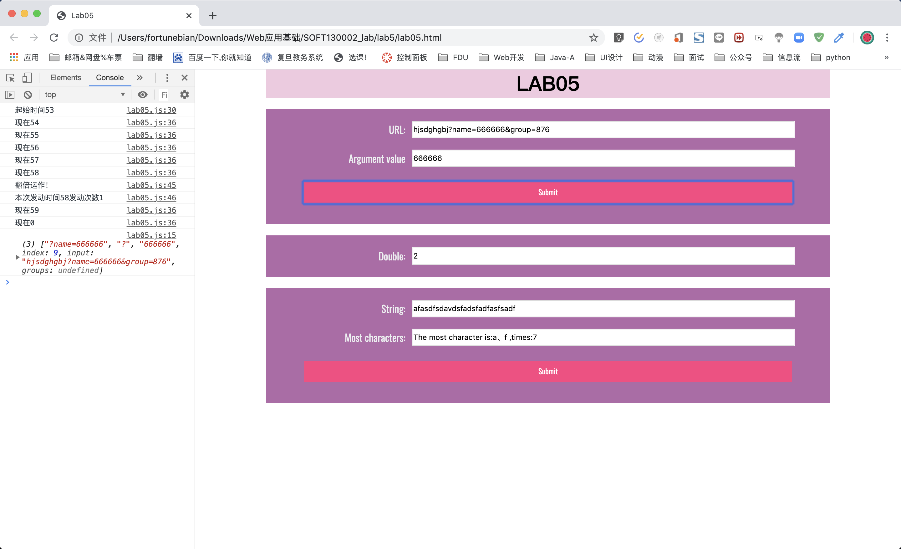
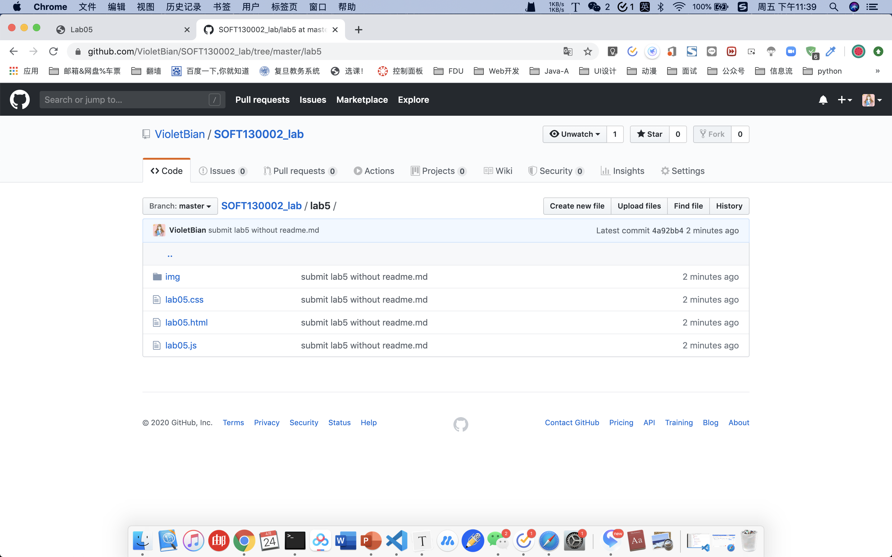

# Lab5设计文档

卞雨喆 18307110428

## 函数相关知识点

1. 函数返回：return的显示结束句用法

> 函数可以通过return语句显式返回
>
> 函数始终会返回一个值
>
> 如果return语句显式返回值，则取该值
>
> 如果仅return语句或缺省return返回，则取undefined

```js
function showWindowHref(){
    var reg = new RegExp("([?]|&)?name=([^&]*)","i");
    var result = url.value.match(reg);
    console.log(result);
    if (result !== null)url_result.value = result[2];
    else url_result.value = "Null of name"
  // 此处显式返回
    return url_result;
}
```

2. 作为值的函数：可以把函数名称作为变量名使用

3. 函数字面量：函数可以被定义后立刻被调用（IIFE）

> 以表达式方式出现，一般用于将函数作为值处理的场所函数名可省略（以匿名函数形式出现）。

```js
var intervalRepeat = setInterval(function(){timeTest()},1000);
//.......
clearInterval(intervalRepeat);
```

4. 匿名函数

```js
var intervalRepeat = setInterval(function(){timeTest()},1000);
```

5. 函数表达式可以先使用再声明

```js
most_submit.addEventListener('click',arrSameStr);
function arrSameStr(){...}
```

## 解决方案

1. 第一题，new一个RegExp正则对象，匹配以【至少一个”？“或”&”二选一】开头，中间必有【name=】，以【自然数个非&符号】结尾的字符串。

   如果match到字符，则所需要的内容是所得字符串数组的第三个值，故获取result[2]。

   若未match到，则填入null of name提示。	

```js
var reg = new RegExp("([?]|&)?name=([^&]*)","i");
```


2. 第二题，在全局中函数外，定义计数器count、起始时间 `formerSecond = (new Date()).getSeconds()`，定义函数字面量`var intervalRepeat = setInterval(function(){timeTest()},1000);`。

   即不被打断时每一秒运行一次timeTest()函数。

   在函数内，每次调用获取时间对象的秒数，一旦满足计数为10或秒数为0则停止每秒循环调用`clearInterval(intervalRepeat);`，return返回。如果当前秒数为前一个时间戳的5秒之后，则更新时间戳为当前秒数并进行一次mul.value翻倍，计数加一，控制台报幕。

   ```js
   let mul = document.getElementById("mul");
   mul.value = 1;
   var count = 0;
   var formerSecond = (new Date()).getSeconds();
   console.log("起始时间"+formerSecond);
   var intervalRepeat = setInterval(function(){timeTest()},1000);
   
   function timeTest(){
       var date = new Date();
       var seconds = date.getSeconds();
       console.log("现在"+seconds);
       if (count == 10 | seconds == 0){
           clearInterval(intervalRepeat);
           return;
       }
       if (seconds - formerSecond == 5) {
           formerSecond = seconds;
           mul.value *= 2;
           count++;
           console.log("翻倍运作！");
           console.log("本次发动时间"+formerSecond+"发动次数"+count);
       }
       
   }
   ```

3. 利用数组的【属性：值】对天然特征，遍历字符串，为新建的数组对象写入字典式【字符：频率次数】内容。

   后利用for...in循环，遍历字符频率字典的每个字符词条，比较其对应频率次数与当前最大频率的大小关系，并置换最大频率。

   <mark>注意：</mark>因为有可能出现**不同字符都是最大频率**的情况，故最频繁字符以数组形式储存，当有新的最大并列，push()进新字符。当有更大的产生，清空该数组只剩当前最大字符。

   ```js
   function arrSameStr(){
       var str = most.value;
       var charFrequencyDic = {};
       for (var i = 0; i < str.length; i++){
           if (!charFrequencyDic[str[i]]) charFrequencyDic[str[i]] = 1;
           else charFrequencyDic[str[i]] += 1;
       }
       var maxObj ={
           maxkey :[],
           maxvalue:0
       }
       for (var k in charFrequencyDic) {
           if (charFrequencyDic[k] > maxObj.maxvalue) {
               maxObj.maxvalue = charFrequencyDic[k];
               maxObj.maxkey = [k];
           }
           else if(charFrequencyDic[k] === maxObj.maxvalue)
               maxObj.maxkey.push(k);
       }
   
       result.value = "The most character is:" + maxObj.maxkey.join("、") + " ,times:" + maxObj.maxvalue;
       
   }
   ```

## 截图



