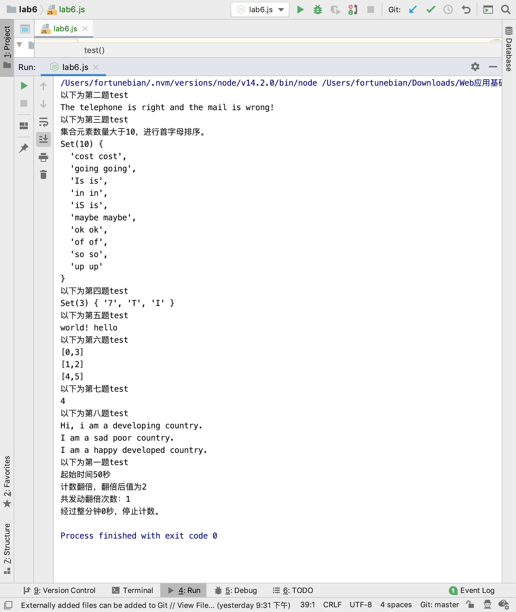

# Lab6设计文档

卞雨喆 18307110428

## 1 正则表达式理解

### 第二题：

```js
var telReg = /1[345789]\d{9}/;
```

电话号码11位，以1开头，第二位鉴于目前的电话卡号情况在3、4、5、7、8、9中都有可能，后续9位为0-9任意数字。

```js
var mailReg = /^\w([-_\.\w]){0,29}\w@[a-zA-Z0-9_-]+(\.[a-zA-Z0-9_-]+)+$/;
```

在网上查找了各大门户网站的邮箱注册要求，提炼出共同点的正则表达式，其含义是：

1. 分为自定义名称+@+域名三部分
2. 首尾必须是字母或数字，不能是符号
3. 长度在4-30之间，这里扩大到/自定义名称2-30位字符
4. 名称部分可以插入下划线、减号或英文点
5. 域名部分可以插入下划线、减号，可由多个xx.xx.xx构成，一定由.xx顶级域名结尾

### 第三题

```js
// 部分代码摘录
var words = str.split(" ");
var redundanceSet = new Set();
var array = new Array();
for (var i = 0; i < words.length; i++) {
    var reg = new RegExp(words[i], "i");
    if (reg.test(words[i + 1])) {
        redundanceSet.add(words[i] + " " + words[i + 1]);
        array.push(words[i] + " " + words[i + 1]);
    }
}
```

首先，把字符串按空格分隔为各个单词组成的数组。

接着在循环中正则表达式不断更新：

正则表达式为**无视大小写**的第i+1个单词。如果第i+2个单词匹配了该正则表达式，说明相邻单词重复，将这两个单词用空格连接并放入集合中。


### 第五题

```js
str = str.trim();
var reg = /\s+/;
```

该正则表达式表示，在首尾去除空格的字符串中匹配到大于等于1个空格的子串，并依此切割原字符串，得到单词组成的数组。


## 2 继承不同方式的理解

1. **借助构造函数：**

   1. 核心语句是`SuperType.call(this[,args]);`

      `Country.call(this);`

   2. 本质是在子类实例中创建了父类属性。

   3. 应在子类构造函数一开始调用父类构造函数，而且必须使用call的调用方式，否则容易造成无限循环。

   4. 好处是：

      1. 避免了原型链方式时把父类的实例的属性变成子类原型属性，产生不必要的覆盖工作。
      2. 而且可以通过子类构造函数向父类构造函数传参，不会影响到其他子类实例。

   5. 坏处是：

      1. 父类实例方法不能复用。
      2. 父类原型中的属性和方法对子类不可见，因此无法同时使用构造和原型。例如在country原型上设一个say函数，developingCountry.say是非function报错。

2. **原型链继承：**

   1. 核心语句是`SubType.prototype = new SuperType();`

      `PoorCountry.prototype = new Country();`，

   2. 本质是创建新父类实例设为子类的原型。

   3. 子类特有方法添加要在原型替换语句后，否则重置会使原型链/原型上的方法丢失。

   4. 好处是：

      1. 父类原型上的方法能在子类实例中调用。
      2. 可以在子类原型中覆盖父类方法

   5. 坏处是：

      1. 把父类的实例的属性变成子类原型属性，产生不必要的覆盖工作
      2. 不能通过子类构造函数向父类构造函数传参，会影响到其他子类实例。

3. **原型式继承 Object.creat()**：

   `DevelopedCountry.prototype = Object.create(Country.prototype,{name:{value: "developed country"}});`

   1. 核心语句是`Object.create(proto[, propertiesObject])`
      1.  可选属性是添加到新创建对象的可枚举属性（即其自身的属性，而不是原型链上的枚举属性）
      2. 此处加入了name的属性覆盖。
   2. 本质是做了已有对象的浅复制，不会重新创建引用类型的新实例。
   3. 初始对象中的引用类型属性会被所有副本共享
   4. “创建类似的对象=继承”思想；可以混用借助构造函数。
      1. 此处混用了call函数，使得父类实例的name也能兜底构造。
   5. 好处是：
      1. 便于新增属性，可以覆盖原有属性。
      2. 属性在原型下而非实例下
      3. 同时可以使用父类的原型的属性和方法。


## 3 Map、Set、Array之间的区别和使用

这三都有迭代器，可以使用原型的方法进行隐式迭代。如forEach()方法。


### Set

Set的核心是集合的不重复性，所以可以通过生成set/加入set自动过滤重复内容：

例如第四题键盘坏了，同字母缺失加入set可以自动合并为1个键的缺失原因。

但是Set的键值相同，具有无序性，使用迭代时需要注意。


### Map

Map很像python的字典，换句话说字典一词很好的形容了Map的作用。

它可以看做特殊的二维数组——这一点在节省for循环时非常有用。（此处应该和群里大佬说的时间复杂度有关）

例如第七题，就是使用Map达成了一维时间轴上2个标记的分别平移。（不知道到底应该怎么用专业术语表述，大概觉得是这样）

Map比普通Object更强大在于，其键可以是非字符串。

Map.prototype.entries()在输出键值对数组时很方便。


### Array

Array可以看做键是由自然数组成的字典，也可看作类列表。

#### **访问方法：**

由于自然数的特性，它的处理方法更丰富，比如头尾插入/修改/删除、排序/反序……

同时，Array是和String互动更加直接强大的类，Array.join() 与String.split()互为逆反应。

#### 迭代方法：

除了Map/Set共同的迭代方法外，数组还有更多的迭代方法。例如第六题中，用

```js
for (var i = 0; i < nums.length; i++){
    if (nums[i] == undefined) continue;
    sumRight = (element) => element+nums[i] == target;
    if (nums.findIndex(sumRight)) {
        ……
    }
}
```

`findIndex(callback[, thisArg])`方法返回数组中满足提供的测试函数的第一个元素的**索引**。否则返回-1。

这样的方式直接地返回符合条件的元素index，并进行后续操作，把对应index的array值转化为undefined，在下次读到时（说明这一对数已经算过了）跳过。


## 4 图




